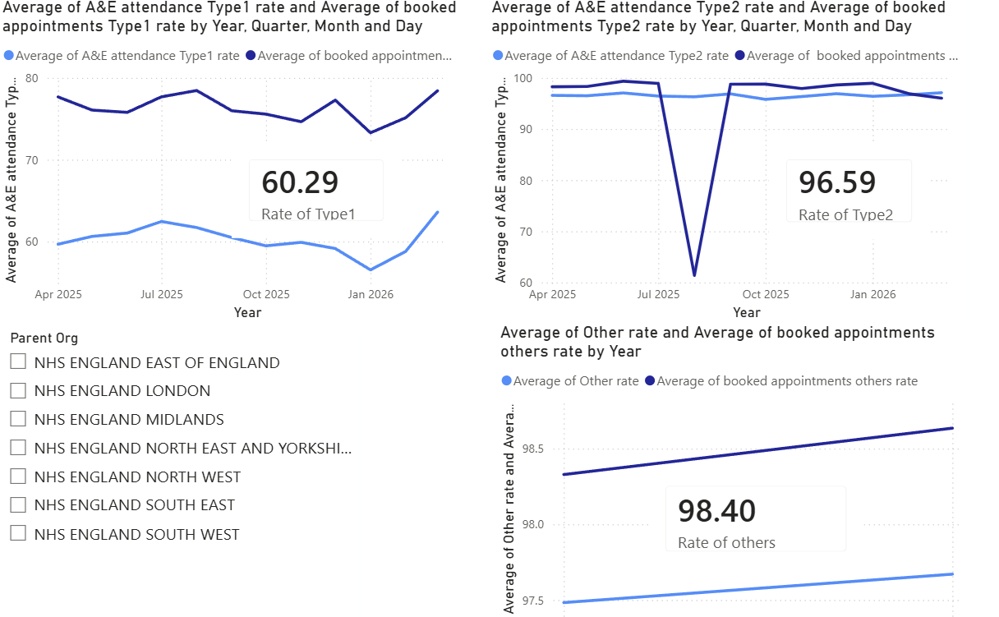
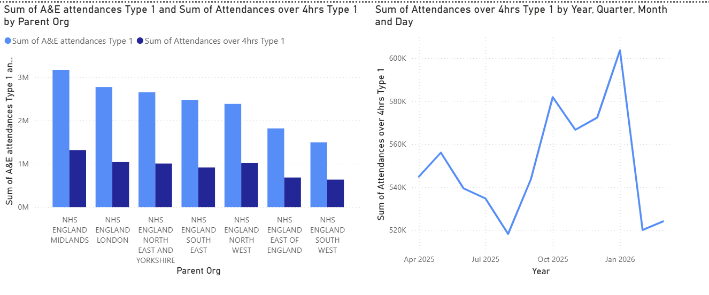

# NHS England A&E Performance Analysis Dashboard

A Power BI portfolio project analyzing Accident & Emergency (A&E) performance data published by NHS England, the UK's National Health Service.

## Overview

In England, the percentage of A&E patients treated, admitted, or discharged within 4 hours of arrival is a key national performance target. This project analyzes 12 months of hospital-level A&E data (April 2025 – March 2026) published monthly by NHS England, exploring trends, seasonality, and regional performance differences.

## Key Insights

The average 4-hour performance rate for Type 1 (major, 24/7 consultant-led emergency departments) stands at 60.7%, highlighting a clear challenge in meeting waiting-time targets at the departments that handle the most serious cases. In contrast, Type 2 and Other departments (specialty and minor injury units) maintained a performance rate above 90%, suggesting a significant gap in capacity to manage demand depending on facility type and scale.

When broken down by attendance type, patients with booked appointments showed a higher 4-hour performance rate than walk-in patients. This suggests that scheduled, planned capacity may contribute to shorter waiting times compared to unscheduled arrivals.

At the hospital and regional level, while attendance volumes varied considerably, the 4-hour performance rate itself showed relatively little regional variation. This suggests that the decline in performance is less a localized issue and more a structural challenge facing Type 1 emergency care as a whole.

The analysis also reveals a clear seasonal pattern: the national average 4-hour performance peaked at around 62% in summer (July 2025) before declining to roughly 57% in winter (January 2026). This aligns with known seasonal pressures on emergency services, such as increased respiratory illness and elderly admissions during winter months.

Looking at absolute patient numbers for Type 1, the number of patients waiting more than 4 hours exceeded 560,000 every single month from October 2025 through January 2026 — a scale of impact that percentage-based metrics alone do not fully capture. This points to a compounding effect of surging winter demand and constrained Type 1 capacity.

## Data Source

- **Publisher**: NHS England — [A&E Attendances and Emergency Admissions statistics](https://www.england.nhs.uk/statistics/statistical-work-areas/ae-waiting-times-and-activity/)
- **Period**: April 2025 – March 2026 (monthly, 12 files)
- **Granularity**: Individual NHS Trust / provider level, monthly aggregates

## Tools & Process

| Stage | Tools / Techniques |
|---|---|
| Data ingestion | 12 monthly CSVs downloaded from NHS England's official site |
| Data combination | Power Query "Folder" connector — automated combination of multiple files |
| Data cleaning | Type conversion, handling of null/zero-division cases, removal of aggregate ("TOTAL") rows |
| Feature engineering | Custom columns calculating 4-hour performance rate (%) by attendance type and booking status |
| Data modeling | Star schema — fact table + Calendar dimension table, joined via `PeriodDate` |
| Analysis | DAX measures (average, min, max performance) |
| Visualization | Line charts (monthly trend), regional bar chart, interactive slicers |

## Technical Highlights

- Automated ingestion of multiple monthly files using Power Query's folder-combine feature, avoiding manual copy-paste
- Identified and handled division-by-zero and missing-value patterns in the source data using conditional (`if`) logic in M
- Broke down performance rates by attendance type (Type 1/2/3) and booking status (walk-in vs. booked appointment) for more granular analysis
- Built a proper date dimension table using DAX (`CALENDAR()`) and linked it via a many-to-one relationship for time intelligence support

## Screenshots

## Files

- `NHS_AE_Dashboard.pbix` — Power BI dashboard file

## Possible Extensions

- Add multiple years of data to enable year-over-year (YoY) comparison
- Combine with other NHS open datasets (e.g. bed occupancy) for a more complete operational view
- Publish to Power BI Service for scheduled refresh and sharing

